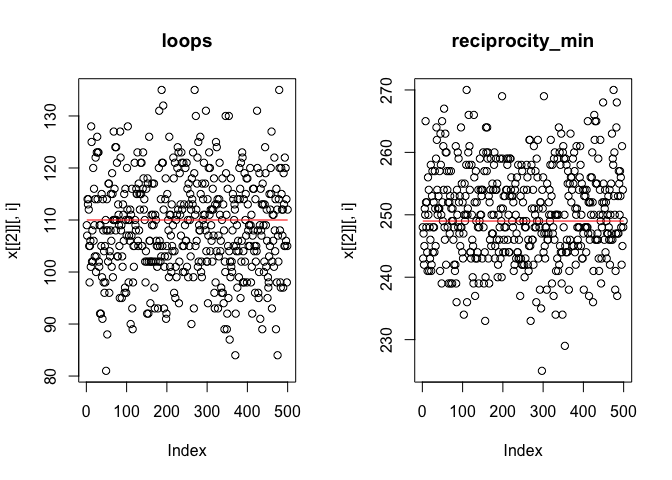
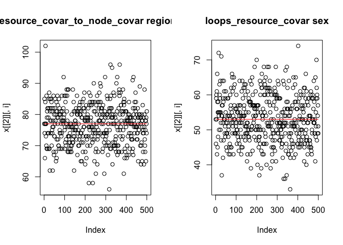
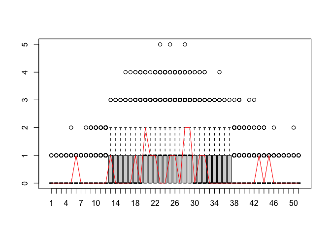
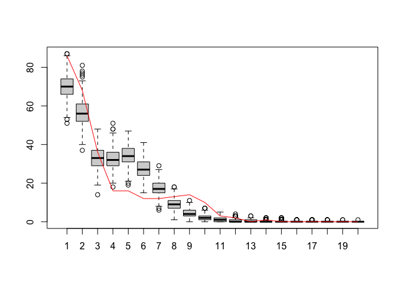

<!-- README.md is generated from README.Rmd. Please edit that file -->

# MoNAn

<!-- badges: start -->
<!-- badges: end -->

MoNAn is the software implementation of the statistical model outlined
in:

Block, P., Stadtfeld, C., & Robins, G. (2022). A statistical model for
the analysis of mobility tables as weighted networks with an application
to faculty hiring networks. Social Networks, 68, 264-278.

as found
[here](https://www.sciencedirect.com/science/article/pii/S0378873321000654).

# Installation

The package is still under development. You can install the development
version of MoNAn from GitHub with:

``` r
# install.packages("devtools")
devtools::install_github("perblock/MoNAn")
```

or using:

``` r
# install.packages("remotes")
remotes::install_github("perblock/MoNAn")
```

# Example

This script runs a simple example with the data from the MoNAn package.

``` r
library(MoNAn)

# packages for parallel computing
library(snow)
library(snowfall)
```

## The Data

The example case is using synthetic data that represents mobility of 742
individuals between 17 organisations. The artificial data includes an
edgelist, i.e. a list of origins and destinations of individuals sorted
by origin.

``` r
mobilityEdgelist[1:10,]
#>       [,1] [,2]
#>  [1,]    1    1
#>  [2,]    1    1
#>  [3,]    1    2
#>  [4,]    1    2
#>  [5,]    1    2
#>  [6,]    1    2
#>  [7,]    1    3
#>  [8,]    1    3
#>  [9,]    1    3
#> [10,]    1    3
```

The data further includes (artificial) characteristics of individuals,
here their sex, but a continuous covariate is also possible in many
cases.

``` r
indSex[1:10]
#>  [1] 1 1 0 0 0 0 1 0 1 0
```

Characteristics of the organisations are the region in which they are
located (binary, e.g., northern/southern island) and the organisations’
size.

``` r
orgRegion
#>  [1] 1 1 1 1 1 1 1 0 0 0 0 0 0 0 0 0 0
orgSize
#>  [1]  3.202903  5.178353  7.592492  7.368718  9.098950  7.977469  7.751859
#>  [8] 10.454544  7.811348  4.958048  7.740106  6.112728  6.640621  2.850886
#> [15]  8.955254  7.597493  9.313139
```

## Working with the package

### Preparing the data

First, create data objects from the introduced data files, which are
later combined to the process state

``` r
# create objects
transfers <- createEdgelist(mobilityEdgelist, nodeSet = c("organisations", "organisations", "people"))
people <- createNodeSet(1:nrow(mobilityEdgelist))
organisations <- createNodeSet(1:length(orgRegion))
sameRegion <- outer(orgRegion, orgRegion, "==") * 1
sameRegion <- createNetwork(sameRegion, nodeSet = c("organisations", "organisations"))
region <- createNodeVariable(orgRegion, nodeSet = "organisations")
size <- createNodeVariable(orgSize, nodeSet = "organisations", addSim = TRUE)
sex <- createNodeVariable(indSex, nodeSet = "people")
```

Combine the data objects into the process state, i.e., an object that
stores all information that will be used in the estimation later.

``` r
myState <- createProcessState(list(
  transfers = transfers,
  
  people = people,
  organisations = organisations,
  
  sameRegion = sameRegion,
  region = region,
  size = size,
  sex = sex
))
```

Define the dependent variable, and create a cache, a necessary object
used in the simulations. In case variables of the individuals in the
data are included in the state, they need to be explicitly mentioned in
the creation of the cache under “resourceCovariates”.

``` r
myDependentVariable <- "transfers"
myCache <- createWeightedCache(myState, myDependentVariable, resourceCovariates = c("sex"))
```

Specify the model. The predictors in the model are called “Effects” and
they are defined in a list. Each effect itself is a list that contains
the effect name and additional parameters that it needs.

``` r
# create an effects object
myEffects <- createEffectsObject(
  list(
    list("loops"),
    list("min_reciprocity"),
    list("dyadic_covariate", attribute.index = "sameRegion"),
    list("alter_covariate", attribute.index = "size"),
    list("resource_covar_to_node_covar", attribute.index = "region", resource.attribute.index = "sex"),
    list("loops_resource_covar", resource.attribute.index = "sex")
  )
)
```

Optional: run a pseudo-likelihood estimation to get improved initial
estimates. This increases the chances of cenvergence in the first run of
the estimation considerably

``` r
# create multinomial statistics object pseudo-likelihood estimation
myStatisticsFrame <- getMultinomialStatistics(myState, myCache, myEffects, myDependentVariable)

### additional script to get pseudo-likelihood estimates, requires the dfidx and mlogit package
# library(dfidx)
# library(mlogit)
# my.mlogit.dataframe <- dfidx(myStatisticsFrame,
#                           shape = "long", 
#                           choice = "choice")
# 
# colnames(my.mlogit.dataframe) <- gsub(" ", "_", colnames(my.mlogit.dataframe))
# 
# IVs <- (colnames(my.mlogit.dataframe)[2:(ncol(myStatisticsFrame)-2)])
# 
# f <- as.formula(paste("choice ~ 1 + ", paste(IVs, collapse = " + "), "| 0"))
# 
# my.mlogit.results <- mlogit(formula = eval(f), data = my.mlogit.dataframe, heterosc = F)
# 
# summary(my.mlogit.results)
#
# initEst <- my.mlogit.results$coefficients[1:length(IVs)]
```

### Estimation

Now estimate the model. The first two lines indicate the dependent
variable, data (state), cache, and effects. The third line specifies the
intial estimates, where the previously obtained pseudo-likelihood
estimates can be used. The remaining lines define the algorithm (see
helpfiles).

Running the model takes a while (up to 10 minutes for this data with
parallel computing).

``` r
myResDN <- estimateMobilityNetwork(myDependentVariable,
  myState, myCache, myEffects,
  initialParameters = NULL,
  burnInN1 = 1500, iterationsN1 = 50, thinningN1 = 750, gainN1 = 0.1,
  burnInN2 = 7500, nsubN2 = 4, initGain = 0.2, thinningN2 = 1500,
  initialIterationsN2 = 25,
  iterationsN3 = 500, burnInN3 = 7500, thinningN3 = 3750,
  parallel = T, cpus = 4,
  allowLoops = T,
  verbose = T,
  returnDeps = T,
  multinomialProposal = F,
  fish = F
)
```

In case a pseudo-likelihood estimates have been obtained previously,
replace with

``` r
myResDN <- estimateMobilityNetwork(myDependentVariable,
  myState, myCache, myEffects,
  initialParameters = initEst,
  burnInN1 = 1500, iterationsN1 = 50, thinningN1 = 750, gainN1 = 0.1,
  burnInN2 = 7500, nsubN2 = 4, initGain = 0.2, thinningN2 = 1500,
  initialIterationsN2 = 25,
  iterationsN3 = 500, burnInN3 = 7500, thinningN3 = 3750,
  parallel = T, cpus = 4,
  allowLoops = T,
  verbose = T,
  returnDeps = T,
  multinomialProposal = F,
  fish = F
)
```

Check convergence to see whether the results are reliable. In case the
maximum convergence ratio is above 0.1 (or 0.2 for less precise
estimates), another run is necessary.

``` r
max(abs(myResDN$convergenceStatistics))
#> [1] 0.04541426
```

Re-run estimation with previous results as starting values and check
convergence:

``` r
myResDN <- estimateMobilityNetwork(myDependentVariable,
  myState, myCache, myEffects,
  prevAns = myResDN,
  burnInN1 = 1500, iterationsN1 = 50, thinningN1 = 750, gainN1 = 0.1,
  burnInN2 = 7500, nsubN2 = 4, initGain = 0.2, thinningN2 = 3000,
  initialIterationsN2 = 40,
  iterationsN3 = 500, burnInN3 = 15000, thinningN3 = 7500,
  parallel = T, cpus = 4,
  allowLoops = T,
  verbose = T,
  returnDeps = T,
  multinomialProposal = F,
  fish = F
)
```

``` r
# check convergence
max(abs(myResDN$convergenceStatistics))
#> [1] 0.04541426
```

In case convergence is still poor, updating the algorithm might be
necessary. Otherwise, view results, where the first column is the
estimate, the second column the standard error and the third column the
convergene ratio. All values in the finla column should be below 0.1
(see above).

``` r
myResDN
#> Results
#>                                   Effects   Estimates StandardErrors
#> 1                                   loops  2.59047738     0.18065574
#> 2                         min_reciprocity  0.81390378     0.19389546
#> 3             dyadic_covariate sameRegion  1.68755130     0.11189750
#> 4                    alter_covariate size  0.03616745     0.02483439
#> 5 resource_covar_to_node_covar region sex -0.64794362     0.16764479
#> 6                loops_resource_covar sex -0.36810363     0.21342903
#>   Convergence
#> 1 -0.03726664
#> 2  0.02279557
#> 3  0.04522141
#> 4  0.02760621
#> 5 -0.04541426
#> 6 -0.03304023
```

## Some diagnostics

Both indicate the extent to which the chain mixes (i.e., whether the
thinning was chosen appropriately). For the autoCorrelationTest, lower
values are better. Values above 0.5 are very problematic.

``` r
autoCorrelationTest(myDependentVariable, myResDN)
#> [1] 0.1027527
```

For the extractTraces, the plot should show data point randomly
scattered around the target line.

``` r
traces <- extractTraces(myDependentVariable, myResDN, myEffects)

par(mfrow = c(1,2))
plot(traces)
```



## score-tests

Based on an estimated model, a score-type test is available that shows
whether statistics representing non-inlcuded effects are well
represented. If this is not the case, it is likely that including them
will result in significant estimates.

Note that it is advisable that the model specification that is tested
includes all effects from the previously estimated model.

``` r
myEffects2 <- createEffectsObject(
  list(
    list("loops"),
    list("min_reciprocity"),
    list("dyadic_covariate", attribute.index = "sameRegion"),
    list("alter_covariate", attribute.index = "size"),
    list("resource_covar_to_node_covar", attribute.index = "region", resource.attribute.index = "sex"),
    list("loops_resource_covar", resource.attribute.index = "sex"),
    list("min_transitivity")
  )
)

test_ME.2 <- scoreTest(myDependentVariable, myResDN, myEffects2)
test_ME.2
#> Results
#>                                   Effects pValuesParametric
#> 1                                   loops      9.702724e-01
#> 2                         min_reciprocity      9.818133e-01
#> 3             dyadic_covariate sameRegion      9.639308e-01
#> 4                    alter_covariate size      9.779762e-01
#> 5 resource_covar_to_node_covar region sex      9.637771e-01
#> 6                loops_resource_covar sex      9.736425e-01
#> 7                        min_transitivity      2.428713e-09
#>   pValuesNonParametric
#> 1                0.556
#> 2                0.526
#> 3                0.494
#> 4                0.476
#> 5                0.562
#> 6                0.532
#> 7                0.000
#> 
#>  Parametric p-values: small = more significant 
#>  Non-parametric p-values: further away from 0.5 = more significant
```

The interpretation is that there appears to be some transitive
clustering in the data that the model does not account for in its
current form.

## GOF testing

Akin to ERGMs, goodness of fit testing is available to see whether
auxiliary statistics are well captured by the model.

``` r
myGofIndegree <- gofDistributionNetwork(ans = myResDN, simulations = myResDN$deps, gofFunction = getIndegree, lvls = 1:100)
plot(myGofIndegree)
```



``` r

myGofTieWeight <- gofDistributionNetwork(ans = myResDN, simulations = myResDN$deps, gofFunction = getTieWeights, lvls = 1:30)
plot(myGofTieWeight)
```


