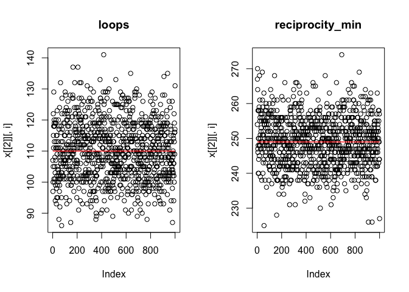
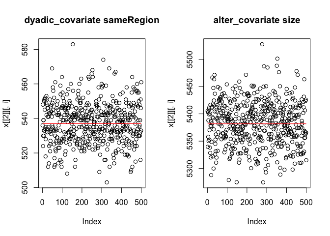
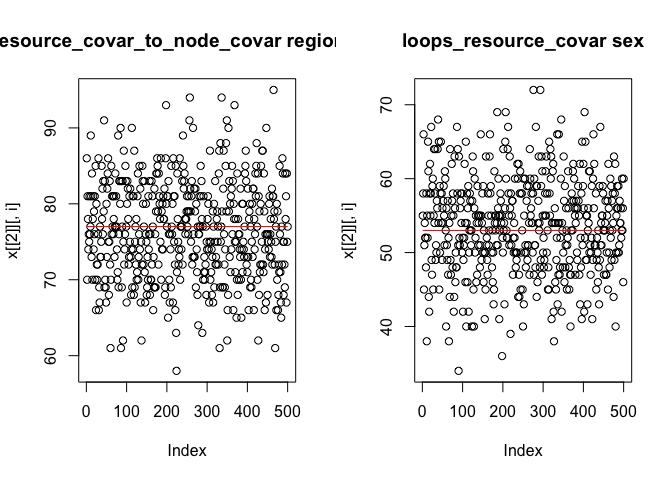
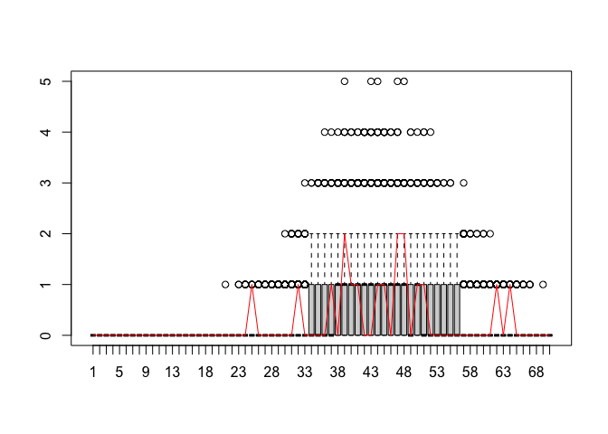

<!-- README.md is generated from README.Rmd. Please edit that file -->

# MoNAn

<!-- badges: start -->
<!-- badges: end -->

MoNAn is the software implementation of the statistical model outlined
in:

Block, P., Stadtfeld, C., & Robins, G. (2022). A statistical model for
the analysis of mobility tables as weighted networks with an application
to faculty hiring networks. Social Networks, 68, 264-278.

[Link to the study in Social
Networks](https://www.sciencedirect.com/science/article/pii/S0378873321000654).

[Pre-print with minor differences to the journal
version](https://osf.io/preprints/socarxiv/n86rx/).

The model allows for the analysis of emergent structures (known from
network analysis) in mobility tables, alongside exogenous predictors. It
combines features from classical log-linear models for mobility tables
and Exponential Random Graph Models (ERGMs). In the absence of emergent
structures, the models reduces to the former, when ignoring
characteristics of individuals, it is an ERGM for weighted networks.

Announcements about workshops etc. can be found
[here](https://www.suz.uzh.ch/de/institut/professuren/block/monan_software.html).

# Note from the developers

As of 30 Aug 2023, we have a CRAN release of the package. Nevertheless,
the package and the documentation might still have bugs or errors, or
you might not be able to do what you want. In that case, or if you are
unsure please write the package maintainer under his institutional email
address.

# Installation

You can install MoNAn either from CRAN or from GitHub.

The advantage of installing from github is that you will always stay
up-to-date with the latest developments, in particular, new
functionality and effects. You can install the current version of MoNAn
from GitHub using:

``` r
# install.packages("remotes")
remotes::install_github("perblock/MoNAn")
```

However, you can also get the (often slightly older) CRAN version with:

``` r
install.packages("MoNAn")
```

# Example

In this section, we outline a simple example with synthetic data stored
in the MoNAn package.

``` r
library(MoNAn)
```

## The Data

The example case uses synthetic data that represents mobility of 742
individuals between 17 organisations. The artificial data includes an
edgelist, i.e., a list of origins (column 1) and destinations (column 2)
of all individuals sorted by origin.

``` r
mobilityEdgelist[1:10,]
#>       [,1] [,2]
#>  [1,]    1    1
#>  [2,]    1    1
#>  [3,]    1    2
#>  [4,]    1    2
#>  [5,]    1    2
#>  [6,]    1    2
#>  [7,]    1    3
#>  [8,]    1    3
#>  [9,]    1    3
#> [10,]    1    3
```

The data further includes (artificial) characteristics of individuals,
which we will call sex. However, using continuous covariates is also
possible, although for some effects this would not be meaningful.

``` r
indSex[1:10]
#>  [1] 1 1 0 0 0 0 1 0 1 0
```

Characteristics of the organisations are the region in which they are
located (binary, northern/southern island) and the organisations’ size
that represents a composite measure of the number of workers, assets,
and revenue.

``` r
orgRegion
#>  [1] 1 1 1 1 1 1 1 0 0 0 0 0 0 0 0 0 0
orgSize
#>  [1]  3.202903  5.178353  7.592492  7.368718  9.098950  7.977469  7.751859
#>  [8] 10.454544  7.811348  4.958048  7.740106  6.112728  6.640621  2.850886
#> [15]  8.955254  7.597493  9.313139
```

## Working with the package

### Preparing the data

First, we create MoNAn data objects from the introduced data files. A
necessary part is that we define and name the nodesets, i.e., we name
who (“people”) is mobile between what (“organisations”).

``` r
# extract number of individuals and organisations from the mobility data

N_ind <- nrow(mobilityEdgelist)
N_org <- length(unique(as.numeric(mobilityEdgelist)))

# create monan objects
people <- createNodeSet(N_ind)
organisations <- createNodeSet(N_org)
transfers <- createEdgelist(mobilityEdgelist, nodeSet = c("organisations", "organisations", "people"))
sameRegion <- outer(orgRegion, orgRegion, "==") * 1
sameRegion <- createNetwork(sameRegion, nodeSet = c("organisations", "organisations"))
region <- createNodeVariable(orgRegion, nodeSet = "organisations")
size <- createNodeVariable(orgSize, nodeSet = "organisations", addSim = TRUE)
sex <- createNodeVariable(indSex, nodeSet = "people")
```

We combine the data objects into the process state, i.e., a MoNAn object
that stores all information about the data that will be used in the
estimation later. Here we also need to specify what will be the outcome
variable to be modelled in the analysis.

``` r
myState <- createProcessState(
  list(
    transfers = transfers,
    
    people = people,
    organisations = organisations,
    
    sameRegion = sameRegion,
    region = region,
    size = size,
    sex = sex
  ),
  dependentVariable = "transfers"
)
```

We create a cache (a necessary object used in the estimation of the
model). In case variables of the individuals in the data are included in
the state (here: “sex”), they need to be explicitly mentioned in the
creation of the cache under “resourceCovariates”.

``` r
myCache <- createWeightedCache(myState, resourceCovariates = c("sex"))
```

### Specifying the model

The predictors in the model are called “Effects” and they are defined in
a list. Each effect itself is a list that contains the effect name and
the additional parameters it needs.

``` r
# create an effects object
myEffects <- createEffectsObject(
  list(
    list("loops"),
    list("reciprocity_min"),
    list("dyadic_covariate", attribute.index = "sameRegion"),
    list("alter_covariate", attribute.index = "size"),
    list("resource_covar_to_node_covar", 
         attribute.index = "region", resource.attribute.index = "sex"),
    list("loops_resource_covar", resource.attribute.index = "sex")
  ),
  checkProcessState = myState
)
```

### Optional: Pre-estimation

We can run a pseudo-likelihood estimation that gives a (biased) guess of
the model results. We use this to get improved initial estimates, which
increases the chances of model convergence in the first run of the
estimation considerably. To get pseudo-likelihood estimates, we need to
use functions from other libraries to estimate a multinomial logit model
(e.g., “dfidx” and “mlogit”)

``` r
# create multinomial statistics object pseudo-likelihood estimation
myStatisticsFrame <- getMultinomialStatistics(myState, myCache, myEffects)

### additional script to get pseudo-likelihood estimates, requires the dfidx and mlogit package
# library(dfidx)
# library(mlogit)
# my.mlogit.dataframe <- dfidx(myStatisticsFrame,
#                           shape = "long", 
#                           choice = "choice")
# 
# colnames(my.mlogit.dataframe) <- gsub(" ", "_", colnames(my.mlogit.dataframe))
# 
# IVs <- (colnames(my.mlogit.dataframe)[2:(ncol(myStatisticsFrame)-2)])
# 
# form <- as.formula(paste("choice ~ 1 + ", paste(IVs, collapse = " + "), "| 0"))
# 
# my.mlogit.results <- mlogit(formula = eval(form), data = my.mlogit.dataframe, heterosc = FALSE)
# 
# summary(my.mlogit.results)
#
# initEst <- my.mlogit.results$coefficients[1:length(IVs)]
```

### Specifying the estimation algorithm

The estimation algorithm requires multiple parameters that guide the
simulation of the chain. Most values are generated by default from the
state and the effects object.

``` r
myAlg <- createAlgorithm(myState, myEffects, multinomialProposal = FALSE)
```

### Estimation

Now we can estimate the model. The first two lines indicate the
dependent variable, data (state), cache, and effects. The third line
specifies the initial estimates, where the previously obtained
pseudo-likelihood estimates can be used. The remaining lines define
whether parallel computing should be used, how much console output is
desired during the estimation, and whether the simulations from phase 3
should be stored.

Running the model takes a while (up to 10 minutes for this data with
parallel computing).

``` r
myResDN <- estimateMobilityNetwork(
  myState, myCache, myEffects, myAlg,
  initialParameters = NULL,
  parallel = TRUE, cpus = 4,
  verbose = TRUE,
  returnDeps = TRUE,
  fish = FALSE
)
```

In case pseudo-likelihood estimates have been obtained previously, this
can be specified by

``` r
myResDN <- estimateMobilityNetwork(
  myState, myCache, myEffects, myAlg,
  initialParameters = initEst,
  parallel = TRUE, cpus = 4,
  verbose = TRUE,
  returnDeps = TRUE,
  fish = FALSE
)
```

Check convergence to see whether the results are reliable. In case the
maximum convergence ratio is above 0.1 (or 0.2 for less precise
estimates), another run is necessary.

``` r
max(abs(myResDN$convergenceStatistics))
#> [1] 0.1158889
```

If convergence is too high, update algorithm, re-run estimation with
previous results as starting values and check convergence:

``` r
# estimate mobility network model again based on previous results to improve convergence
# with an adjusted algorithm
myAlg <- createAlgorithm(myState, myEffects, multinomialProposal = TRUE, 
                         initialIterationsN2 = 500, nsubN2 = 1, initGain = 0.02, iterationsN3 = 1000)

myResDN <- estimateMobilityNetwork(
  myState, myCache, myEffects, myAlg,
  prevAns = myResDN,
  parallel = TRUE, cpus = 4,
  verbose = TRUE,
  returnDeps = TRUE,
  fish = FALSE
)
```

``` r
# check convergence
max(abs(myResDN$convergenceStatistics))
#> [1] 0.1158889
```

In case convergence is still poor, updating the algorithm might be
necessary. Otherwise, we can view the results. The first column is the
estimate, the second column the standard error, and the third column the
convergence ratio. All values in the final column should be below 0.1
(see above).

``` r
myResDN
#> Results
#>                                   Effects   Estimates StandardErrors
#> 1                                   loops  2.55119590     0.16767219
#> 2                         reciprocity_min  0.80886194     0.17076331
#> 3             dyadic_covariate sameRegion  1.66660275     0.11099617
#> 4                    alter_covariate size  0.03613363     0.02307136
#> 5 resource_covar_to_node_covar region sex -0.64131049     0.16544747
#> 6                loops_resource_covar sex -0.34885512     0.21719272
#>   Convergence
#> 1 -0.08272621
#> 2 -0.03402212
#> 3 -0.08645417
#> 4 -0.11588893
#> 5 -0.01607496
#> 6 -0.02259394
```

## Diagnostics of the estimated model

The following two diagnostics indicate the extent to which the chain
mixes (i.e., whether the thinning was chosen appropriately). The
autoCorrelationTest indicates the degree to which the values of the
dependent variable of consecutive draws from the chain in phase 3 are
correlated. Here lower values are better. Values above 0.5 are very
problematic and indicate that a higher thinning is needed.

``` r
autoCorrelationTest(myResDN)
#> [1] 0.09344565
```

The output of extractTraces indicates the correlation of statistics
between subsequent draws from the chain in phase 3. The plot should show
data points randomly scattered around the target line, as shown below.
If patterns in the traces are discernible, a higher thinning is needed.

``` r
traces <- extractTraces(myResDN, myEffects)

par(mfrow = c(1,2))
plot(traces)
```



## Score-tests to check model specification

Based on an estimated model, a score-type test is available that shows
whether statistics representing non-included effects are well
represented. If this is not the case, it is likely that including them
will result in significant estimates.

``` r
myEffects2 <- createEffectsObject(
  list(
    list("transitivity_min")
  )
)

test_ME.2 <- scoreTest(myResDN, myEffects2)
test_ME.2
#> Results
#>            Effects pValuesParametric pValuesNonParametric
#> 1 transitivity_min      1.149344e-09                    0
#> 
#>  Parametric p-values: small = more significant 
#>  Non-parametric p-values: further away from 0.5 = more significant
```

The interpretation is that there appears to be some transitive
clustering in the data that the model does not account for in its
current form.

## GOF testing

Akin to ERGMs, goodness of fit testing is available to see whether
auxiliary statistics are well captured by the model.

``` r
myGofIndegree <- gofMobilityNetwork(ans = myResDN, simulations = myResDN$deps, gofFunction = getIndegree, lvls = 1:70)
plot(myGofIndegree, lvls = 1:70)
```



``` r

myGofTieWeight <- gofMobilityNetwork(ans = myResDN, simulations = myResDN$deps, gofFunction = getTieWeights, lvls = 1:20)
plot(myGofTieWeight, lvls = 1:20)
```


## Simulation

The package also provides the possibility to exemplarily simulate
mobility networks based on the data and the specified effects and
parameters.

``` r
mySimDN <- simulateMobilityNetworks(
  myState,
  myCache,
  myEffects,
  parameters = c(2, 1, 1.5, 0.1, -1, -0.5),
  allowLoops = TRUE,
  burnin = 45000,
  thinning = 15000,
  nSimulations = 10
)

mySimDN[[1]]
```
